# Architecture

## Data flow

From pole device to operator screen, the full pipeline:

```mermaid
flowchart LR
    subgraph Field["Field devices (~700 poles)"]
        D["Pole device<br/>(power_lost / power_restored / heartbeat)"]
    end

    subgraph Ingest["Ingestion layer"]
        API["POST /telemetry<br/>validate + 202"]
        Q["Redis LIST<br/>(LPUSH / BRPOP)"]
        W["Worker thread<br/>dedup · stale filter · debounce 30s"]
    end

    subgraph Graph["Localization engine"]
        T["build_topology<br/>known edges + MST for 60% missing"]
        L["localize_all<br/>boundary traversal: live parent → dark child"]
        N["noise_filter<br/>dead-sensor · scheduled-outage · debounce"]
    end

    subgraph Tickets["Ticket lifecycle"]
        TC["ticket_creation<br/>dedup against open tickets"]
        AI["AI summary<br/>Gemini Flash Lite → template fallback"]
        TK["Ticket row<br/>detected → acknowledged → crew_assigned<br/>→ resolved → verified → closed"]
        AV["Auto-verify<br/>worker scans resolved tickets<br/>confirms poles live from telemetry"]
    end

    subgraph UI["Operator console (Streamlit :8501)"]
        DASH["Dashboard<br/>ticket list · status badges · confidence"]
        SIM["Simulator panel<br/>inject faults · restore poles"]
    end

    D -->|HTTP POST| API
    API --> Q
    Q --> W
    W --> T
    T --> L
    L --> N
    N --> TC
    TC --> AI
    AI --> TK
    TK --> AV
    TK --> DASH
    SIM -->|POST /simulate/*| API
```

## Simulator

Since the department does not provide real data, the simulator is treated
as first-class work, not a test fixture bolted on at the end.

**Grid generation** (`simulator/generate_grid.py`): builds a synthetic
radial tree — substations → feeders → DTs → poles, with branches/spurs —
matching the proportions in 02-data-and-systems.md rather than its absolute
scale (see DECISIONS.md). Critically, we generate the FULL real topology
first, then null seq_on_line/parent_pole_id for a random 60% of DTs
afterward, preserving the real values separately in
ground_truth_topology.csv. This lets us later measure our MST inference's
accuracy against reality, not just eyeball plausibility.

**Fault injection** (`simulator/inject_fault.py`): computes which poles
should go dark for a span/DT/feeder fault, using the private ground-truth
topology (not the stripped CSV) — exactly mirroring how a real fault would
propagate regardless of whether we've digitized that DT's wiring order.

**Telemetry emission** (`simulator/telemetry_emitter.py`): converts a dark-
pole set into realistic, messy HTTP payloads: ~70% dying-breath success
rate, ~8% of devices silently on legacy firmware (no power_lost event at
all), ±90s clock skew, shuffled arrival order, ~5% duplicate delivery,
~3% stale retries up to 6 hours old. Poles with no device are silently
excluded, matching the ~9% coverage gap.

**Test coverage**: 26 tests across seven files, organized by the specific
failure mode each guards against (span faults, DT faults, missing-
topology fallback, dead-sensor suppression, scheduled-outage handling,
worker dedup/debounce, ticket lifecycle, ticket-creation wiring) — see
`backend/tests/`.

**Load testing** (`simulator/load_test.py`): separate from fault scenarios
— fires synthetic message volume at the ingest endpoint to validate
sustained (≥500 msg/s) and burst (5,000 msgs/10s) throughput targets,
independent of how many unique poles exist in the grid.

**Driving it**: `simulator/run_scenario.py span|dt|feeder|noise` is the
single command (and will back the UI's simulator controls) — satisfies
G5.
## Storage and internal model

Two tables, matching the department's CSV exports column-for-column
(pole_registry.csv, dt_registry.csv) — see 02-data-and-systems.md §3.

`Pole`: pole_id (PK), lat/lon, feeder_id, dt_id (FK), seq_on_line,
parent_pole_id, pole_type, ward, pincode, device_id.

`Transformer`: dt_id (PK), feeder_id, lat/lon, capacity_kva,
households_served.

`seq_on_line` and `parent_pole_id` are nullable **by design**, present in
the schema from the first draft rather than retrofitted — this directly
reflects the 60%-missing-topology condition that is the assignment's
central problem, not an edge case bolted on later.

The database holds static topology (poles, transformers) — it is not used
for live pole energized/dark state, which changes far faster than a DB
round-trip justifies. Live state lives in-memory in the ingestion worker
(see below) and is what actually drives localization.

## Data sourcing and ingestion

**Ingest endpoint** (`POST /telemetry`): validates the device payload
against the exact schema in 02-data-and-systems.md §2 (device_id, pole_id,
event, energized, ts, seq, battery_mv, rssi, fw), pushes it onto a Redis
list, and returns 202 Accepted immediately. No graph work happens inside
the HTTP handler — this is what lets the endpoint survive a burst without
buckling (§1: up to 5,000 messages in 10 seconds).

**Queue** (Redis, single LIST, LPUSH/BRPOP): a simple FIFO queue was
sufficient at this scale (one subdivision, a few thousand poles) — see
DECISIONS.md for why we didn't reach for a heavier broker like Kafka.

**Worker** (`app/ingestion/worker.py`): drains the queue and maintains
in-memory pole state. Two responsibilities directly mirroring the brief's
dirty-data rules:

- **Dedup/ordering**: uses `(device_id, seq)`, not `ts`, since device
  clocks skew up to ±90 seconds and are unreliable for cross-device
  ordering (§2). A message with `seq` ≤ the last-seen `seq` for that
  device is dropped as a duplicate or stale retry.
- **Stale-retry filtering**: `power_lost` events older than 6 hours (by
  device timestamp) are discarded — offline devices retry buffered
  messages for up to 6 hours per §2, and a very old retry should not
  raise a fresh ticket for a long-resolved incident.
- **Debounce**: a pole is only added to the "ready for localization"
  set after being continuously dark for 30 seconds, absorbing burst
  duplicates and out-of-order arrival before triggering a graph run.

## The localization algorithm

**Topology construction** (`app/graph/build_topology.py`): one directed
graph per DT.

- 40% case (known `parent_pole_id`): edges taken directly from the data,
  tagged VERIFIED, confidence 0.95.
- 60% case (missing topology): edges reconstructed via a geometric
  Minimum Spanning Tree over Haversine distance, rooted at the DT's own
  coordinates, tagged INFERRED, confidence 0.60. Edges point away from the
  DT (matching real power-flow direction) via a BFS re-rooting step.

We validated the MST approach against a held-out ground-truth topology
generated alongside our synthetic grid (`ground_truth_topology.csv`,
never read by the running system — see Simulator section above). Measured
result: **87.6% edge-level accuracy** (333/380 correct parent assignments
across the 10 topology-stripped DTs in our test grid). Known limitation:
real wires bend around buildings and roads; the MST assumes straight
lines, so errors cluster near branch points where Euclidean distance
doesn't reflect true spur structure.

**Boundary traversal** (`app/graph/localize.py`): per 01-problem-context.md
§2, a fault is the frontier between the live region and the dark region.
For each DT graph, we find every edge (parent, child) where parent is
live and child is dark — each is a candidate span-fault boundary.
Downstream poles are collected via graph descendants (BFS), and
overlapping boundaries are merged so one physical fault produces one
incident regardless of how many poles are affected.

**Grouping and multi-fault handling**: DT-level faults (every device-
bearing pole under a DT is dark) are reported once, not as N span
alerts. Feeder-level faults (every DT on a feeder down) are rolled up
similarly — but only when a feeder has 2+ DTs; a single-DT feeder's full
outage is reported at DT-level, since it's indistinguishable from a
feeder fault by pole data alone and DT-level is the more specific,
defensible answer (see DECISIONS.md). Independent boundaries — in the
same or different DTs — are each reported as separate incidents, so three
simultaneous span faults produce three tickets, not one merged ticket
and not thirty.

**Complexity**: topology construction is O(N log N) per DT for the MST
(N = poles under that DT, typically 15-80 in our test grid); boundary
traversal is O(E) per DT. Both run once per debounce cycle, not per
message, keeping this well inside the 120s p95 target even at burst load.

## Noise handling

**Dead-sensor / "lying sensor" filtering** (`app/graph/localize.py`,
`is_dead_sensor`): a pole reporting dark whose children are still live is
physically impossible as a real line fault — power cannot skip a dead
wire on a radial network (01-problem-context.md §2). Such poles are
excluded from the dark set before boundary-finding runs, so they never
generate a ticket.

**Scheduled-outage cross-check** (`app/graph/noise_filter.py`): the
scheduled-outage feed is not trusted blindly, per 02-data-and-systems.md
§4 — outages start late, overrun by 20-40 minutes, and ~10% are cancelled
without the feed updating. We widen the outage window with documented
slack (15 min early-start allowance, 40 min overrun allowance) and then
verify coverage: if an incident's affected poles cover the *full* scope
of a matching scheduled outage, it's suppressed as planned maintenance.
If only a *subset* of poles are dark while the rest of the scope stays
live, the incident is kept — that pattern indicates a real fault
happening during, not because of, the maintenance window.

**Debounce** (see Data sourcing above) is the third leg of noise
handling: a single ambiguous dark signal doesn't trigger localization
until it's persisted for 30 seconds, absorbing the "one dying message,
maybe lost" ambiguity described in 01-problem-context.md §4.

**Test coverage**: 16 tests across five files, organized by the specific
failure mode each guards against (span faults, DT faults, missing-
topology fallback, dead-sensor suppression, scheduled-outage handling,
worker dedup/debounce) — see `backend/tests/`.

## Ticket lifecycle

Tickets move through: detected → acknowledged → crew_assigned → resolved
→ verified → closed (`app/services/ticket_lifecycle.py`).

The one rule enforced strictly: **verified can only be reached via
telemetry confirmation, never a direct status update.** A `PATCH
/tickets/{id}/status` request setting status="verified" is rejected
outright (400). The only path to "verified" is `POST
/tickets/{id}/verify`, which checks the CURRENT live-energized state of
every pole the ticket claims is affected (read from the same in-memory
tracker the ingestion worker updates) and refuses with 409 if any
affected pole is still dark or has never reported live since the fault.

This was proven end-to-end, not just unit tested: a ticket was walked
through detected → resolved, `/verify` was correctly rejected (409)
before restoration telemetry arrived, real `power_restored` telemetry
was sent through the actual `/telemetry` endpoint, and a second
`/verify` call succeeded (200) once the worker had processed it — the
full "restoration confirmed from telemetry, not a button click"
requirement, exercised live, not just asserted in a unit test.

## Ingestion → localization → ticket, wired end to end

The ingestion worker runs as a background thread inside the same process
as the FastAPI app (not a separate service) — deliberate, so ticket
verification can read live pole state directly from shared memory
(`shared_tracker`) without an extra network hop. Tradeoff documented in
DECISIONS.md: this doesn't horizontally scale past one API instance;
scaling to multiple replicas would require moving pole state to Redis.

On every worker loop iteration, the worker checks which poles have been
continuously dark for 30+ seconds (debounced), and if any exist, runs
them through `build_full_topology()` (loaded from the DATABASE, not CSV
— the DB is the system of record once seeded) → `localize_all()` →
`filter_scheduled_outages()` (cross-checked against the mocked outage
feed before any ticket is created) → deduplication against currently
open tickets, matched by incident type + location identity.

**Known limitation, observed on real live testing** (not caught by unit
tests, which all used complete/simultaneous telemetry): because
telemetry for one physical fault can arrive in separate bursts (coverage
gaps, legacy firmware, dying-breath failures), different branches of the
same DT-level fault can cross the debounce threshold at different times,
producing multiple span-level tickets instead of one DT-level ticket.
Documented in DECISIONS.md as a "two more weeks" item — the fix requires
a product decision (merge/upgrade strategy for open tickets), not a
quick patch.

## Coordinates and PIN code

Ticket coordinates depend on incident type: span faults use the
downstream pole's own surveyed GPS (the actual fault location); DT
faults use the transformer's own coordinates; feeder faults leave
coordinates unset — the UI should render these as a zone/DT list, not a
map pin, since there is no single point for a feeder-wide fault. PIN
code is pulled from the downstream pole's record where available
(missing for ~3% of poles per the registry).

## API surface

| Method | Path | Purpose |
|--------|------|---------|
| GET | `/health` | Liveness check |
| POST | `/telemetry` | Accepts one device telemetry message, queues it, returns 202 |
| GET | `/telemetry/queue-status` | Current Redis queue depth |
| GET | `/tickets` | List tickets, optional `?status=` filter |
| GET | `/tickets/{id}` | Single ticket detail |
| PATCH | `/tickets/{id}/status` | Ordinary lifecycle moves. Rejects any attempt to set "verified" directly. |
| POST | `/tickets/{id}/verify` | Telemetry-enforced resolved→verified transition. 409 if affected poles aren't confirmed live. |
| GET / POST / DELETE | `/scheduled-outages` | Mock department feed, shared with the ticket-creation noise filter |
| POST | `/simulate/fault/span` \| `/fault/dt/{dt_id}` \| `/fault/feeder/{feeder_id}` | Drives the simulator via HTTP — satisfies G5. Reuses the same fault-injection/telemetry logic as the standalone CLI simulator. |
| POST | `/simulate/restore/{pole_id}` | Sends restoration telemetry for one pole, to demonstrate auto-verification in the demo video |

## UI reasoning

The operator console (Streamlit, `frontend/app.py`) is designed for a
single persona: a control-room operator at 2am who is not an engineer.

**What the operator sees first**: the ticket list, sorted by detection
time (newest first), with color-coded status badges and confidence
indicators. A high-confidence VERIFIED ticket looks different from a
low-confidence INFERRED one — this is deliberate, so the operator
instinctively prioritises the one we're most sure about.

**What is deliberately NOT on screen**:
- No raw pole-level telemetry feed. The operator doesn't need to see 500
  heartbeats/second — they need to see "there's a fault, here's where,
  here's how sure we are."
- No graph visualisation of the topology. Interesting for debugging, but
  an operator dispatching a crew doesn't need to see MST edges.
- No manual topology editing. The 60% missing-topology problem is handled
  by the algorithm, not by asking a non-engineer to fix data at 2am.
- No user authentication. A real deployment would need it; for this
  assignment it would add complexity without demonstrating any relevant
  engineering skill.

**What we expect to be wrong**: the ticket list will get unwieldy past
~50 concurrent faults (a monsoon peak day). A production system would
need pagination, filtering by feeder/area, and probably a map view. We
chose a flat list because it's honest about what we built and doesn't
pretend a leaflet map pin is useful when 60% of our locations are
MST-inferred estimates.

## The AI feature

**What it is**: a plain-language ticket summary, generated by
Google Gemini 2.0 Flash Lite, shown alongside the structured ticket data
in the operator console. Example: *"Span fault between P-c3ca56 and
P-5027ea, 9 poles affected, high confidence, PIN 560086."*

**Why this spot and not elsewhere**: the brief is explicit that an LLM
doing the fault localization itself is a disqualifier — graph traversal
is deterministic, instant, free, and explainable; an LLM is none of
those. This feature sits strictly AFTER localization, consuming its
already-correct structured output. The LLM never decides where the fault
is; it only helps a tired 2am operator parse a JSON-shaped ticket faster.

**Cost per call**: Gemini 2.0 Flash Lite, ~100 input tokens + ~50 output
tokens per ticket summary. At Google's current pricing this is
effectively free at the outage volumes this system handles (12–18/day
typical, up to 120 on a monsoon peak day).

**When the model is unavailable or wrong**: if the API key is missing,
the network is down, the response is malformed, or the call times out
(5s), the system falls back to a deterministic template string built from
the same structured fields — the operator ALWAYS gets a readable summary.
This is tested explicitly: `test_ai_feature.py` includes dedicated tests
for `ConnectionError`, malformed JSON response, and missing API key, not
just the happy path. A wrong summary cannot cause a wrong dispatch
because the structured data (pole IDs, coordinates, confidence) is
always shown alongside it.

## Performance targets

Per 03-deliverables-and-submission.md, measured rather than guessed:

| Metric | Target | Measured | Method |
|--------|--------|----------|--------|
| Fault → ticket visible | < 120s p95 | ~35s typical | Live end-to-end test: inject span fault via simulator, time until ticket appears in GET /tickets |
| Ingest sustained throughput | ≥ 500 msg/s | ~800 msg/s | `simulator/load_test.py`, 5000 messages over 6s, measured via queue drain time |
| Ingest burst | 5,000 msgs / 10s | ✅ handled | Same load test, 5000 messages sent in <10s, all processed without errors |
| Console page load | < 2s | ~1s | Streamlit initial render with seeded data, measured via browser dev tools |
| Restoration → verified | < 120s | ~35s | Live test: send power_restored via /simulate/restore, time until auto-verify fires |